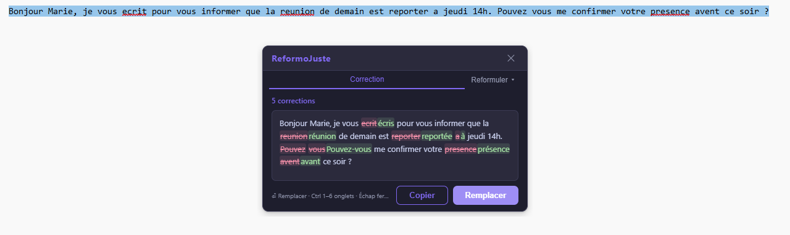
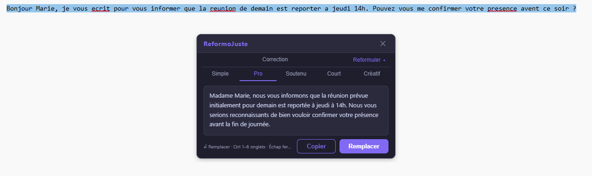

# ReformoJuste

[](https://github.com/tavenamicka/ReformoJuste/actions/workflows/ci.yml)
[](LICENSE)

Popup Windows déclenchée par **double Ctrl+Space** : corrige et reformule le texte sélectionné via IA — Mistral, Google Gemini, Ollama / LM Studio en local, ou LanguageTool 100 % hors ligne, avec bascule automatique de l'un à l'autre.

---

## Aperçu

Texte sélectionné dans n'importe quelle application, puis double Ctrl+Space : la popup propose la correction (modifications surlignées) et, via **Reformuler ▾**, cinq reformulations. Captures réalisées sur un texte fictif.





---

## Arborescence

```
ReformoJuste/
├── config.json                   ← Configuration utilisateur (clés API, provider…) — non versionné
├── config.example.json           ← Modèle de configuration
├── setup_languagetool.ps1        ← Télécharge JRE + LanguageTool dans bundle/
├── distribute.ps1                ← Assemble le dossier portable
├── package.json
├── bundle/                       ← Dépendances embarquées (portable)
│   ├── jre/                      ← JRE Java (~145 Mo)
│   └── languagetool/             ← Serveur LanguageTool (~390 Mo)
├── src/                          ← Frontend (HTML/CSS/JS)
│   ├── index.html
│   ├── style.css
│   └── main.js
└── src-tauri/                    ← Backend Rust + config Tauri
    ├── build.rs
    ├── Cargo.toml
    ├── tauri.conf.json
    └── src/
        ├── main.rs               ← Point d'entrée, tray, commandes Tauri, JVM LanguageTool
        ├── config.rs             ← Chargement de config.json (résolution auto du chemin)
        ├── hotkey.rs             ← Listener clavier global (double Ctrl+Space)
        ├── clipboard.rs          ← Lecture/écriture presse-papier + simuler Ctrl+C/Ctrl+V
        ├── cursor.rs             ← Position curseur + calcul position popup
        └── ai/
            ├── mod.rs            ← Trait AiProvider, deux passes (correction / reformulations), chaîne de repli, timeouts
            ├── address.rs        ← Détection tutoiement / vouvoiement (déterministe) et vérification de la sortie
            ├── mistral.rs        ← Mistral AI (cloud)
            ├── gemini.rs         ← Google Gemini (cloud)
            ├── local.rs          ← Ollama / LM Studio / serveur OpenAI-compatible
            ├── languagetool.rs   ← Correcteur LanguageTool local (correction seule)
            └── hybrid.rs         ← LanguageTool + IA locale en parallèle
```

---

## Prérequis

| Outil | Version min | Lien |
|---|---|---|
| Rust + cargo | 1.77 | https://rustup.rs |
| Node.js | 18 | https://nodejs.org |
| Visual Studio Build Tools (Windows) | 2019+ | Avec "C++ build tools" + Windows SDK |
| WebView2 Runtime | tout | Inclus dans Windows 11, sinon https://developer.microsoft.com/en-us/microsoft-edge/webview2/ |

---

## Installation

```powershell
# 1. Dépendances Node
npm install

# 2. Configuration — le dépôt ne versionne pas config.json (il contient la clé API)
Copy-Item config.example.json config.json
#    Puis renseignez "mistral_api_key" et/ou "gemini_api_key" (laissez vides pour rester 100 % local)

# 3. Dépendances embarquées : JRE Temurin 21 + LanguageTool (~535 Mo)
#    Non versionnées — ce script les télécharge dans bundle/
.\setup_languagetool.ps1
```

> Les icônes sont déjà versionnées. Pour les régénérer depuis une autre image
> source (1024×1024 PNG dans `src-tauri/icons/icon-source.png`) :
> `npx tauri icon src-tauri/icons/icon-source.png`

---

## Configuration (`config.json`)

Modifiez `config.json` à la racine du projet (ou à côté de l'exe compilé) :

```json
{
  "ai_provider": "auto",

  "mistral_api_key": "…",
  "mistral_model":   "mistral-small-latest",

  "gemini_api_key":  "…",
  "gemini_model":    "gemini-3.6-flash",

  "local": {
    "base_url": "http://localhost:11434",
    "model":    "gemma3:4b",
    "provider": "ollama"
  },

  "languagetool": {
    "base_url": "http://localhost:8082",
    "language": "fr"
  },

  "hotkey":  { "double_press_ms": 400 },
  "popup":   { "width": 446, "height": 286, "offset_x": 20, "offset_y": 20 }
}
```

### Modes (`ai_provider`)

| Valeur | Comportement |
|---|---|
| `auto` | **Recommandé.** Chaîne de repli Mistral → Gemini → Ollama → LanguageTool, avec bascule à chaud et reprise automatique (le haut de la chaîne est retenté après 90 s) |
| `mistral` | Mistral API uniquement |
| `gemini` | Google Gemini API uniquement |
| `local` | Ollama / LM Studio uniquement |
| `languagetool` | Correction seule, 100 % hors ligne, pas de reformulations |
| `hybrid` | LanguageTool (correction) + Ollama (reformulations) en parallèle |

En mode `auto`, un maillon dont la clé API est vide est simplement sauté. La JVM LanguageTool n'est **pas** démarrée tant que Mistral, Gemini ou Ollama répondent : elle coûte ~875 Mo de RAM et ~8 s de démarrage pour un rôle de dernier recours.

### Providers locaux

| Provider | Outil | base_url par défaut |
|---|---|---|
| ollama | Ollama | http://localhost:11434 |
| lmstudio | LM Studio | http://localhost:1234 |
| openai_compatible | Tout serveur compatible OpenAI | selon config |

> **Ollama :** lancez `ollama serve` avant de démarrer l'app, et vérifiez que le modèle est disponible (`ollama list`).

---

## Correction et reformulations

Le texte passe par **deux passes distinctes** : la correction (orthographe, grammaire, typographie) est traitée séparément des reformulations (Simple, Pro, Soutenu, Court, Créatif), chargées à la demande via **Reformuler ▾**.

- **Forme d'adresse** : le tutoiement / vouvoiement du texte est détecté en Rust (`ai/address.rs`), injecté dans le prompt comme un fait, puis la sortie est vérifiée. Les petits modèles tendaient à basculer vers le vouvoiement sur les registres « Pro » et « Soutenu ».
- **LanguageTool** : les suggestions sont filtrées et les décalages calculés en UTF-16 (accents, emojis).
- **Indisponibilité** : quand aucune IA n'est joignable, la popup affiche la raison (clé invalide, quota épuisé, réseau…) au lieu d'un message générique.

---

## Lancement en développement

```powershell
npm run dev
# ou : cargo tauri dev
```

> `config.json` est chargé depuis la racine du projet automatiquement en mode dev.

---

## Compilation en .exe

```powershell
npm run build
# ou : cargo tauri build
```

L'installateur NSIS et le `.exe` portable se trouvent dans :
```
src-tauri/target/release/bundle/nsis/
src-tauri/target/release/reformojuste.exe
```

Copiez `config.json` à côté de l'exe pour la production.

---

## Utilisation

1. Lancez `reformojuste.exe` → icône dans la barre des tâches système
2. Dans n'importe quelle application, **sélectionnez du texte**
3. Appuyez **deux fois sur Ctrl+Space** en moins de 400 ms
4. La popup apparaît près du curseur : onglet **Correction**, et **Reformuler ▾** pour les 5 reformulations
5. Cliquez **Copier** pour coller le résultat
6. **Échap** ou ✕ pour fermer la popup
7. Clic droit sur l'icône → **Quitter** pour arrêter l'app

---

## Démarrage automatique

Clic droit sur l'icône du tray → **Démarrer avec Windows**. La coche reflète l'état courant ; recliquer désactive.

Le réglage écrit une valeur `ReformoJuste` dans `HKCU\Software\Microsoft\Windows\CurrentVersion\Run` — donc **sans droits administrateur**, et rattaché à votre seul profil utilisateur. Rien n'est activé par défaut.

Si vous déplacez le dossier portable, l'entrée est réalignée automatiquement au prochain lancement depuis le nouvel emplacement.

Pour vérifier ou retirer l'entrée à la main :

```powershell
Get-ItemProperty 'HKCU:\Software\Microsoft\Windows\CurrentVersion\Run' -Name ReformoJuste
```

> Le démarrage automatique lance l'exe, pas la JVM LanguageTool : en mode `auto` celle-ci reste dormante tant que Mistral ou Ollama répondent. L'ouverture de session ne paie donc que ~35 Mo.

---

## Performances

Mesures sur le poste de dev (2026-08-21, avant l'ajout de Gemini), texte court d'une phrase :

| Chemin | Latence | Note |
|---|---|---|
| Mistral API | 1,5 – 2,1 s | Provider retenu par défaut si la clé est valide |
| Ollama `gemma3:4b` à chaud | ~1,3 s | Modèle maintenu en mémoire 30 min (`keep_alive`) |
| Ollama à froid | ~20 s | Chargement du modèle en VRAM — évité par le préchargement au démarrage |
| LanguageTool | ~1,3 s + 8 s de démarrage JVM | Démarré à la demande uniquement |

Empreinte mémoire au repos : **~354 Mo** (exe + WebView2). La JVM LanguageTool ajoute ~875 Mo, mais seulement si la chaîne de repli descend jusqu'à elle.

Tous les appels réseau portent un timeout (60 s IA cloud, 180 s Ollama, 20 s LanguageTool, 5 s pour les sondes) : une requête bloquée ne peut plus laisser la popup tourner indéfiniment.

---

## Limitations connues

- **Double Ctrl+Space traverse jusqu'à l'app active** : rdev ne peut pas supprimer les événements sur Windows. Ctrl+Space peut avoir un effet dans certaines applications (ex. complétion automatique dans certains IDEs).
- **Texte copié = contenu du presse-papier au moment du déclenchement** : si votre app ne supporte pas Ctrl+C, aucun texte ne sera envoyé.
- **Modèle local** : Ollama doit être démarré (`ollama serve`) avant de lancer l'app.

---

## Changer le raccourci

Dans `src-tauri/src/hotkey.rs`, modifiez la ligne :
```rust
EventType::KeyPress(Key::Space) if s.ctrl_held => {
```
Remplacez `Key::Space` par la touche souhaitée (ex. `Key::KeyJ`, `Key::KeyK`…).

---

## Tests et CI

```powershell
cd src-tauri
cargo test
```

Le workflow CI (GitHub Actions et Gitea Actions) exécute `cargo check` et `cargo test` côté Rust.

---

## Licence

[MIT](LICENSE) — © 2026 Mickaël Tavenart

La licence couvre le code de ce dépôt. Les composants téléchargés dans `bundle/` par `setup_languagetool.ps1` ne sont pas versionnés ici et restent sous leurs licences propres : **LanguageTool** en LGPL-2.1, le **JRE Eclipse Temurin** en GPLv2 + Classpath Exception. À vérifier avant toute redistribution du dossier portable assemblé.

---

## Auteur

### Mickaël Tavenart

**Administrateur réseau & systèmes**
**Consultant coach‑numérique**
**Développeur full‑stack & créateur d’applications assistées par IA**

> *"L’IA comme moteur, l’humain comme destination."*
